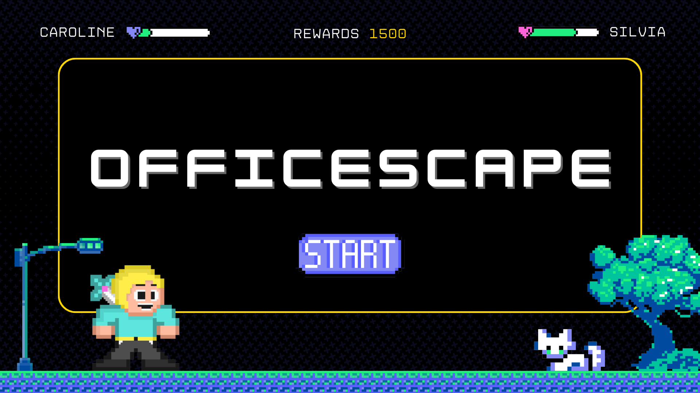

# OfficEscape - Hackathon Challenge Winner 🏆

Unlock Productivity, One Block at Time!

[Presentation](https://www.canva.com/design/DAGKMJhVmjE/_WkdFZt-m9fLqjgF4FzAYg/view?utm_content=DAGKMJhVmjE&utm_campaign=designshare&utm_medium=link&utm_source=editor)

[Prototype](https://www.figma.com/proto/m6GeQtvyMa0BRmIr4Sqs64/officescape?t=ejiDv79vTXzToVxa-1&node-id=1-9&starting-point-node-id=1%3A9)

## ⭐️ Challenge

Build innovative solutions that transform collaboration software into an enjoyable and motivating experience. Whether it's through gamification, engaging user interfaces, interactive features, or unique social elements, your goal is to make teamwork not only productive but also delightful.

## 👀 Problem

In today's corporate landscape, organizations face challenges in maintaining employee engagement and productivity. Despite various tools and systems, employees often feel disconnected and unmotivated, leading to high turnover rates, decreased productivity, and increased costs.

## 🎯 Solution

Imagine a world where work feels like play, where collaboration is seamless and where employees look forward to each workday with excitement and creativity. Introducing our Virtual World Collaboration App, a groundbreaking platform designed to revolutionize corporate team collaboration.
